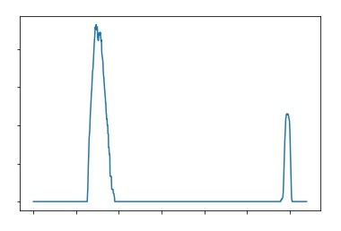

# Advanced Lane Lines Finding

 

## Tools
The tools used to find the lane lines in the images and the videos were:
 - Python
 - OpenCV

## Approach

### Camera Calibration
Every time a camera captures 3D Objects in the real world, it provides a representation of it in 2D images; however, this tranformation is not exact as it modifies the sizes and shapes due to the use of curved lenses. To remove the distortion in the images a camera calibration is required, in order to find the intrinsic parameters and then correct the original images.

For this project, the camera calibration is performed by using chessboard images (One of the most common methods). The input data needed to calibrate the camera is a set of 3D real world points and the corresponding 2D coordinates of these points in the image.

See cell `3` for code and cell `4` for results.

### Undistorting Images
After the camera calibratrion, the camera matrix and the distortion coefficients were obtained. With them I was able to undistort the input images to corret the radial and tangential distorion.

See cell `5` for code and cell `6` for results.

#### Results
Undistorting the input image.

Input Image | Undistorted Image
------------|------------------
 | 

### Image Thresholding
Once the image distortion is corrected we need to find the lane pixels. To do so, different techniques can be applied to process specific color channels and gradients to extract the pixels of our interest and create binary image that contains the lane pixels.

There are many different techiques that you can use to find the lane lines; however, in this project a series of color filters were applied in order to isolate the white and yellow elements in the image and therefore make the lanes clearly visible. The color filters were selected as the main method to extract the pixels of our interest, because they provided the best results in the identification of both color pixels along the images.

A list of the color filters, its respective colorspace and the range used in this project to perform the image thresholding is shown next:

Filter Color | Colorspace | Range
:-----------:|:----------:|:----:
White        |    RGB     | (200, 200, 200) to (255, 255, 255)
White        |    HSV     | (0, 0, 205) to (255, 25, 255)
Yellow       |    HLS     | (15, 50, 100) to (47, 220, 255)
Yellow       |    HSV     | (21, 60, 80) to (40, 255, 255)

It is important to highlight that after the application of each color filter and its respective colorspace transformation, the image went through a histogram equalization and then through a binarization to get pixel values of 0 or 1.

See cell `7` for code and cell `8` for results.

#### Results
* Image thresholding (Color filters).

RGB White | HSV White | HLS Yellow | HSV Yellow
----------|-----------|------------|-----------
 |  |  | 

* Image binarization

 

### Bird's Eye View
The next step of this approach is the Bird's eye transformation of the Binary Image. In this section the image is warped so we can see a section of our interest (ROI) of the original image from above. The main reason to perform this transformation is that having an image seen from above will allow the algorithm to fit a curve on the lane pixels as they are projected on a 2D plane.

See cell `9` for code and cell `10` for results.

#### Results
Bird's eye transformation.

Region of interest (ROI) | Binary Image | Bird's eye view 
-------------------------|--------------|----------------
 |  |  

### Finding the lane lines 
With the Bird's Eye view image and the lane pixels proyected on a 2D plane, the next step for the algorithm was to find the lane lines at each frame. This section of the project was divided in three parts.

1.   Histogram of the Binary Image.
2.   Apply the sliding window method.
3.   Fit a 2nd degree polynomial to the detected lane pixels.

#### Histogram
In order to get a reference and indentify the pixels belonging to the lane lines, I applied a function to find the and calculate the histogram of the image along the X axis (Columns). As the pixels in the binary image are either 0 or 1, the histogram will add the pixels in each column, once the method performs the sum of pixels in the whole frame, two peaks corresponding to the left and right lines are found.

#### Sliding window method
This part of the section is really important. The sliding window method starts from the centre of the peaks obtained from the histogram (in the X axis or columns), at those two points a pair of windows are created with a width of 200 pixels (100 to the left and 100 to the right) and a height of 103 pixels. 

After the first pair of windows are created at the bottom of the image, six additional windows are stacked vertically in the lines shape (from the bottom to the top) and its center is determined by the mean of the pixel coordinates if the amount of pixels within that window is greater than 50.

See cell `11` for code and cell `12` for results.

#### 2nd Degree polynomial fit

To fit a 2nd degree polynomial that represents the left and right lines, the algorithm uses the pixel coordinates (in X and Y) obtained from the sliding window method to calculate it. 

See cell `13` for code and cell `14` for results.

#### Results
Finding lane lines

Histogram | Sliding window | Polynomial fit
----------|----------------|--------------|
 |  | 

### Vehicle position and Road curvature
Finally, the last step of this approach was the calculation of the road curvature and the vehicle position within the lane.

To calculate the road curvature, the algorithm fitted a polynomial to the world space followed by the curvature calculation. To do so, a couple of scale measurementes were used (for X and Y axis). For this project the mean curvature of the left and right curves is shown.

The calculation of the vehicle position was made by using the two detected lane lines and with the assumption that the camera was located in the centre of the image. Similar to the curvature calculation, a scale measurement in the X axis was apply to convert the pixels into distance units (meters).

### Final Result
Next the final result of my project is shown. In the final frame the binary image and the polynomial fit are incuded to see how the algorithm identifies the lines and fits a 2nd degree polynomial. Additional information such as the road curvature and the vehicle position are included as well.

